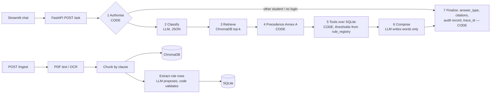

# NSUT Student Services Assistant — HCLTech Hackathon UC1

An AI assistant that answers NSUT students' academic-service questions **only from official NSUT documents and the
student's own records**: every fact is cited (document, section, page, version, effective date), every number and
eligibility decision is computed by **code**, conflicting/versioned documents are resolved with the **Source
Precedence Policy (Annex A)**, and when the sources don't say, it answers *"I could not find this information in the
authorised university sources."*

> Problem statement (full transcript): [`docs/PROBLEM_STATEMENT.md`](docs/PROBLEM_STATEMENT.md) ·
> How the system works, file by file: [`docs/SYSTEM_GUIDE.md`](docs/SYSTEM_GUIDE.md) ·
> Design sign-off doc: [`docs/SPRINT0_DESIGN.md`](docs/SPRINT0_DESIGN.md)

---

## 1. What it does (try these)

| Kind of question | Example | What you get |
|---|---|---|
| Policy fact | "What is the minimum attendance required to appear for end-semester exams?" (as of 2026-10-06) | **80%** — cites the Dean's circular (supersedes Regulations 11.2); flags the CSE FAQ's 65% as lower authority |
| Same question, earlier date | as of 2026-07-15 | **75%** (Regulations 11.2) + "upcoming: circular effective 2026-08-01" |
| Procedure | "How do I apply for the supplementary exam?" | **NSUT has no supplementary exams** — fail → re-register the course (Regulations 12.3) |
| Personal data | S1002: "What is my attendance in Data Structures?" | 31/40 = **77.5%**, computed by a tool from SQLite |
| Personal eligibility | S1002: "Am I eligible to appear in the end-semester exam for Data Structures?" | **Only with relaxation** — 77.5% < 80% minimum but ≥ 60% floor (cites circular §1 + Regulations 11.6) |
| Not answerable | "What is the scholarship for studying in Antarctica?" | `not_found` with the exact message |
| Another student's data | header S1001: "Show me the marks of student S1002" | `refused` (decided by code, before any LLM call) |
| Ambiguous | S1004: "What is my attendance?" | `clarification_needed` — "Which course? CS201 Data Structures, …" |

The `as_of_date` matters: rules are applied as they stood on that date.

---

## 2. Architecture — one fixed LangGraph workflow



### Who decides what
| Decision | Made by | Where |
|---|---|---|
| Is this person allowed to see this? (identity only from `X-Student-Id`) | **Code** | `app/graph.py → authorise` |
| What kind of question is it? | LLM (can only *add* a refusal, never remove one) | `app/graph.py → classify` |
| Which document/rule applies on this date, for this student | **Code** (Annex A) | `app/precedence.py` |
| Every number, threshold, eligibility, pass/fail | **Code** (thresholds read from `rule_registry`) | `app/tools.py` |
| The sentence the student reads | LLM (only from the given sources + tool results) | `app/graph.py → compose`, `app/prompts.py` |
| `answer_type`, which citations are allowed, audit record | **Code** | `app/graph.py → finalize` |

**Why one fixed graph and not multiple agents:** every step except routing and wording is deterministic; extra agents
would add failure points and latency without any requirement needing them.
**Deliberately not built:** a login system (identity = header, per the contract), a second agent, portal features the brief didn't ask for.

### Stack (as mandated)
Streamlit · FastAPI + Uvicorn + Pydantic v2 · LangGraph · ChromaDB (persisted in `storage/`) · SQLite ·
sentence-transformers `all-MiniLM-L6-v2` · Ollama `qwen2.5:7b-instruct` (local) with **Groq as a cloud fallback
behind the `LLM_PROVIDER` switch** · rapidocr (OCR for scanned PDFs) · Docker compose (in progress).

---

## 3. Setup and run

```powershell
git clone https://github.com/techi101/hcl-uc1-student-assistant.git
cd hcl-uc1-student-assistant
pip install -r requirements.txt rapidocr-onnxruntime python-docx
copy .env.example .env                 # add your own GROQ_API_KEY (never commit .env)

# local LLM (recommended on a GPU laptop)
ollama pull qwen2.5:7b-instruct

# build the knowledge base + load data (once; restarts don't re-ingest)
python -m scripts.ingest_all                                     # 11 documents -> ChromaDB (OCR on scanned PDFs, cached)
python -m scripts.load_students --dir data/students_csv --rules data/rules.csv

# run
uvicorn app.main:app --port 8000                                 # API docs: http://localhost:8000/docs
streamlit run ui/streamlit_app.py                                # UI: http://localhost:8501
python -m pytest -q                                              # 33 tests
```
`.env` switches: `LLM_PROVIDER=ollama | groq | mock` (mock = no LLM, for testing the pipeline), `OLLAMA_MODEL`,
`EMBED_MODEL`, `TOP_K`. If port 8000 is busy, use `--port 8010` and set the UI's API URL in the sidebar.

Docker: `docker compose up` (Dockerfile/compose being added — see [`docs/tasks/C_GEETARTH_NOW.md`](docs/tasks/C_GEETARTH_NOW.md)); Ollama runs on the host at `host.docker.internal:11434`.

---

## 4. API (fixed by the HCL contract)

| Endpoint | Purpose |
|---|---|
| `POST /ask` | header `X-Student-Id` (optional for general questions); body `{"question", "as_of_date"?}` |
| `POST /ingest` | multipart `file` + `metadata` (JSON with the Source Register fields) → `{doc_id, chunks_indexed, status}`; usable immediately, no restart |
| `GET /health` | status of API, vector store, SQLite, LLM (and which provider is active) |
| `GET /audit/{trace_id}` | audit record of one answer |
| `GET /sources` | Source Register of everything ingested |
| loader | `python -m scripts.load_students --dir test_students/` |

```bash
curl -X POST localhost:8000/ask -H "Content-Type: application/json" \
  -d '{"question":"What is the minimum attendance required to appear for end-semester exams?","as_of_date":"2026-10-06"}'

curl -X POST localhost:8000/ask -H "Content-Type: application/json" -H "X-Student-Id: S1002" \
  -d '{"question":"Am I eligible to appear in the end-semester exam for Data Structures?","as_of_date":"2026-10-06"}'

curl -X POST localhost:8000/ingest -F "file=@circular.pdf" \
  -F 'metadata={"doc_id":"ACAD-2026-09","title":"Attendance circular","issuer":"Dean (Academics)","authority_level":2,"doc_type":"circular","effective_from":"2026-09-01","supersedes":"NSUT-BTECH-REG-2019#11.2","scope_programmes":"B.Tech","scope_batches":"ALL"}'

curl localhost:8000/health
curl localhost:8000/sources
curl localhost:8000/audit/<trace_id>
```
Response shape of `/ask`: `trace_id, answer, answer_type (retrieved_fact | calculated | not_found | clarification_needed | refused | conflict_flagged), citations[], tools_invoked[], applied_rules[], conflicts_detected[], explanation, as_of_date`.

---

## 5. Data

**Documents** (`data/docs/`, catalogued in [`data/source_register.csv`](data/source_register.csv)): 9 official public NSUT
PDFs — B.Tech Regulations 2019 (level 1, 23 pp, grading tables), Ordinance-II (Delhi Gazette 2020, Hindi + English, and a
university copy), Ph.D. Ordinance-III 2022 (scope test), Fee Structures 2025-26 and 2026-27 (**scanned → OCR**, fee tables,
real version change in re-registration fees), new-student circular 2025, two DHTESS scholarship notifications (scanned) —
plus **2 synthetic documents** (allowed by the brief, marked `synthetic=Y`): a Dean circular raising minimum attendance to
80% from 2026-08-01 (supersedes Regulations 11.2) and a CSE help-desk FAQ claiming 65% (level 4, with a prompt-injection line).

**Rule registry** ([`data/rules.csv`](data/rules.csv) → SQLite `rule_registry`): every threshold the tools use, each linked to
its clause (e.g. `ATT-MIN-01 >= 75` → Regulations 11.2; `ATT-FLOOR-01 >= 60` → 11.6; `PASS-ESE-01 >= 30` → 12.7).

**Synthetic students** ([`data/students_csv/`](data/students_csv/), Annex C schema): 32 students generated with an LLM
(Groq, Pydantic-validated), edge cases planted by code (exactly-at-threshold, one class below, below floor/detained,
ESE < 30%, total 34, absent, multiple backlogs, re-registration, CGPA 5.00/8.50). Details: [`docs/DATA_CARD.md`](docs/DATA_CARD.md),
edge-case IDs: [`data/students_csv/edge_cases.json`](data/students_csv/edge_cases.json), prompts: [`prompts/`](prompts/).

---

## 6. Evaluation

Runner: `python -m eval.run_eval` (all 6 HCL metrics, resumable) · `python -m eval.run_eval --retrieval-only` (no LLM).
Test set: `eval/testset.json` (in progress). **Results: not measured yet on the full test set** — this section will
contain only numbers from a real run.

Measured so far (development checks, not the evaluation):
- Model choice (5 routing questions): qwen2.5:7b + category definitions 5/5 vs 3B 2/5 — [`docs/MODEL_CHOICE.md`](docs/MODEL_CHOICE.md)
- Retrieval on a 12-question dev set: hit@3 = 11/12 for both MiniLM and bge-small; both separate answerable from
  unanswerable questions poorly (top-score gap +0.013 / +0.020) → the not_found decision uses a score floor **and** the
  LLM's "sources don't say" signal.

---

## 7. Assumptions, limitations, known edge cases

**Assumptions:** a document's academic session "2019-20" means effective 2019-07-01 · a scope naming only the degree ("B.Tech")
covers all its branches ("B.Tech CSE") · attendance eligibility has three outcomes per Regulations 11.2–11.7 (≥ minimum →
eligible; ≥ 60% floor → eligible only with relaxation; below → not eligible) · results are unique per (student, course,
exam_session, exam_type) · ESE is 50 of 100 marks (theory pattern, Table 1).

**Limitations:** local 7B on a CPU-only laptop takes ~1–2 min per answer (use a GPU laptop or the Groq fallback) · OCR of
scanned fee tables is imperfect (numbers are cited with their page so they can be checked) · live rule extraction depends on
the LLM proposing the right parameter (the value must appear verbatim in the text, otherwise it is rejected) · no official
placement policy was available, so placement questions are answered only from what the documents say.

**Known edge cases handled:** "How do I…" procedure questions are not treated as personal · a level-3 notice that claims to
supersede a regulation cannot (Annex A step 2 needs level 1–2) · the CSE FAQ never applies to ECE students · re-registration
in a later session clears a backlog (sessions sorted by year + month, not as text).

---

## 8. Team, AI usage, integrity

Team of 3 (a fourth member left during the day): Suryansh, Geetarth, Neetu — contribution statement in
`docs/TEAM_CONTRIBUTION.md` (being written). AI coding assistants (Claude Code) were used to write most of the code from our
prompts; how we verified it (33 tests, evaluation, manual checks against the PDFs) is in `docs/AI_USAGE.md` (being written).
No real student data is used anywhere; student IDs S9000–S9999 and course codes `JDG*` are left free for the judges.
