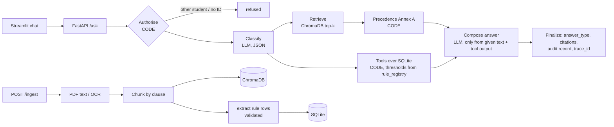

# Sprint 0 Design — NSUT Student Services Assistant (UC1)

## 1. Problem in one line
NSUT students hunt through many PDFs and circulars that change over time; our assistant answers their academic-service
questions **only from official NSUT documents and their own records**, with a citation for every fact, code-computed
eligibility, and an honest "I could not find this" when the sources don't say.

## 2. What "done" means (from the guide)
- Policy answers cite **document, section/page, version, effective date** (R2)
- Personal numbers and eligibility come from **code tools over SQLite**, never LLM arithmetic (R5)
- Conflicting/versioned documents resolved by **Annex A precedence** relative to `as_of_date` (R4)
- Fixed API: `POST /ask`, `POST /ingest`, `GET /health`, `GET /audit/{trace_id}`, `GET /sources` + student CSV loader
- Judges will ingest **unseen documents** and load **their own students** live

## 3. Our data
| Source | What | Links by |
|---|---|---|
| NSUT B.Tech Regulations 2019 (level 1, 23 pp, 5 tables) | attendance 75% (11.2), relaxation 10%+5% (11.3–11.4), floor 60% → FD (11.6–11.7), no supplementary exams (12.3), pass 30% in ESE (12.7), degree CGPA 5.00 (15.1) | doc_id + clause |
| Ordinance-II (Delhi Gazette 2020) + university copy (level 1, Hindi+English) | "attendance as prescribed in the Regulations" → **cross-reference** | doc_id + clause |
| Ph.D. Ordinance-III 2022 (level 1) | Ph.D. only → **scope filter test** (must not answer B.Tech questions) | scope_programmes |
| Fee Structure 2025-26 and 2026-27 (level 2, **scanned → OCR**, many tables) | summer re-registration ₹14,000 → ₹10,000 exam-only / ₹14,000 study; refund table new in 2026-27 → **real version conflict** | effective_from |
| Scholarship notices 2023-24, 2025 (level 2, scanned) | eligibility 75% / CGPA 7.5 / ₹3 lakh; wording differs from Govt scheme | doc_id |
| 2 synthetic docs (allowed, marked `synthetic=Y`) | Dean circular raising attendance minimum (level 2, supersedes 11.2) + Dept FAQ with a lower number (level 4) → **demo of Annex A steps 2 and 3** | supersedes |
| Synthetic students (LLM-generated, Annex C schema) | ≥30 students, 2 programmes (B.Tech CSE, B.Tech ECE), 2 batches (2023, 2024), ≥6 courses, all edge cases | student_id, course_code |
| rule_registry (SQLite) | every threshold with source doc + clause | rule_id → source_doc_id |

## 4. User stories (build order)
| ID | As a… | I want… | Done when | MVP |
|---|---|---|---|---|
| US1 | student | ask a rule question and get a cited answer | "Minimum attendance?" returns `retrieved_fact` citing Regulations clause 11.2, page, version, date | ✅ |
| US2 | student | an honest "not found" | 3 out-of-scope questions return `not_found` with the exact message; no citation | ✅ |
| US3 | student | my attendance / eligibility computed from my records | S1001 + "Am I eligible for CS201 end-sem?" → `calculated`, tool outputs shown, threshold read from rule_registry | ✅ |
| US4 | university | other students' data protected | header S1001 asking for S1002's marks → `refused`; personal question without header → `refused` | ✅ |
| US5 | student | the rule that applies **today** when documents conflict | synthetic circular + FAQ: answer follows Annex A, `conflicts_detected` explains the step; future-dated doc mentioned as "upcoming" | ✅ |
| US6 | admin / judge | add a document and students while the system runs | `POST /ingest` → chunks_indexed > 0 and the next question cites it; `load_students.py --dir` loads CSVs and reports rejects | ✅ |
| US7 | student | multi-step / what-if answers | "I failed DS; if I clear re-registration, am I promoted?" → combines tools + clauses, states assumptions | later |
| US8 | evaluator | measured quality | eval script over ≥20 questions prints all 6 metrics; 2 configurations compared | ✅ (by 16:00) |

## 5. Architecture — one fixed LangGraph workflow (simplest design that meets the requirements)

**LLM does only 2 things:** route the question, write the sentence. **Code does:** authorisation, precedence, every number, every eligibility decision, answer_type, citations.
Why not multi-agent: every step except routing and wording is deterministic, so extra agents add failure points and latency without a requirement needing them.

| Component | Tool (mandated) | Why / choice we made |
|---|---|---|
| UI | Streamlit | minimal, scored for usability only |
| API | FastAPI + Pydantic v2 | contract validation: bad input → 422, not a crash |
| Orchestration | LangGraph | fixed graph = predictable, testable node by node |
| Vectors | ChromaDB on disk | no re-ingest on restart |
| Embeddings | all-MiniLM-L6-v2 vs bge-small | **decided by our eval numbers** (comparison = config 1 vs 2) |
| LLM | Ollama `qwen2.5:7b-instruct` local; Groq behind `LLM_PROVIDER` switch as fallback | measured: 7B routes 5/5 vs 3B 2/5 (docs/MODEL_CHOICE.md) |
| Data | SQLite, Annex C schema with CHECK constraints | DB itself rejects attended > held, bad IDs |
| OCR | rapidocr (onnx) for pages with no text layer | our fee notices are scanned; judges' docs may be too |

## 6. MVP vs later
- **MVP (by ~14:00):** US1–US4 end to end through the real API, cited answers, refusals, attendance eligibility tool, synthetic data + validator + loader
- **By 16:00:** US5 precedence + conflicts, US6 live ingest incl. rule rows, eval report with 6 metrics, audit endpoint, Docker
- **If time:** US7 multi-step, hybrid search (BM25 + vectors), GPU laptop as shared Ollama server
- **Not doing:** login system (identity = header per contract), multi-agent supervisor, fine-tuning

## 7. Test and evaluation plan
- **Unit tests:** scope matching (B.Tech ⊇ B.Tech CSE; 2023+), Annex A steps 1–5 on the worked example, attendance tiers at exactly 75 / one class below / <60, refusal of other IDs and names, validator catches planted bad rows, /ingest accepts lenient metadata
- **Eval set ≥ 24 questions** (guide minimum 20): 3+ not answerable, 3+ versions/conflicts, 4+ personal via tools, 2+ other-student attempts, 2+ multi-step, rest policy/procedure — each with expected answer + expected doc/section
- **Metrics:** answer correctness (exact for numbers/dates), citation accuracy, abstention accuracy, tool-result correctness, retrieval hit rate @k, p50/p95 latency + LLM calls + tokens
- **Method:** exact match for numbers / answer_type / doc_id; human-graded rubric for wording; config comparison MiniLM vs bge (and top-k 3 vs 5)

## 8. Responsible AI
Never fabricate (not_found gate + citations only from retrieved chunks) · identity only from header, other students refused, names not logged · document text fenced as untrusted data, level-5 content can't override · no real student data, reserved S9xxx / JDG unused · audit record per answer, no chain-of-thought · AI-usage disclosure in README.

## 9. Risks and fallbacks
| Risk | Fallback |
|---|---|
| Local LLM slow on thin laptop (~5 s/call) | demo on GPU laptop (Predator / Omen); Groq behind config switch |
| 7B gives invalid JSON | JSON mode + Pydantic validation + 1 retry, then default route |
| LLM extracts a wrong rule from a new circular | value must appear verbatim in the chunk; logged in audit; manual `/admin/rules` |
| Scanned text OCR errors in fee tables | cite page; numbers checked against OCR text; known limitation in README |
| Judge metadata in unexpected format | lenient schema: only doc_id, title, authority_level, effective_from required |

## 10. Team split (each person owns files; all commit)
| Person | Owns |
|---|---|
| A — Suryansh | documents → OCR → clause chunks → ChromaDB, `/ingest`, precedence (Annex A) |
| B | synthetic data generator + validator + loader, SQLite, tools, rule_registry |
| C | FastAPI, LangGraph workflow, audit, Streamlit, Docker |
| D | Source Register, rule rows from documents, eval set (24 Qs), README, data card, presentation |

## 11. Questions for the experts
1. Sections 6.1 and Annex A.3 / D disagree (77.5% "eligible" at 75% vs circular raising it to 80%) — separate examples?
2. When a judge ingests a circular that changes a threshold, do you expect the rule_registry to update automatically, or may an admin add the rule row?
3. Does scope "B.Tech" cover student programme "B.Tech CSE"? What file types will judges ingest (scanned PDF? DOCX?)
4. NSUT Regulations 12.3 say there are **no supplementary exams** — is answering "NSUT has no supplementary exam (clause 12.3)" the expected behaviour for those example questions?
